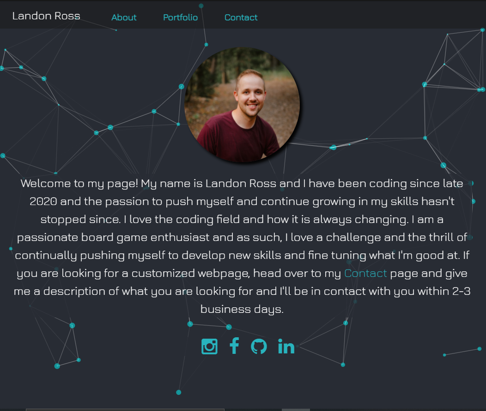
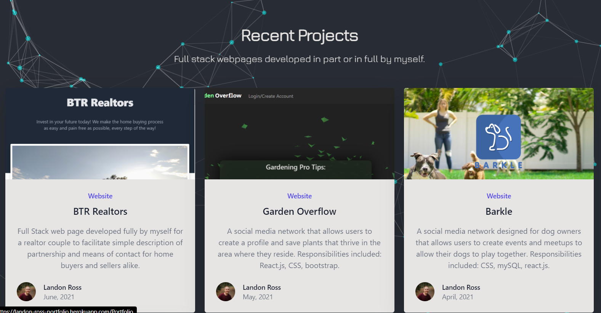
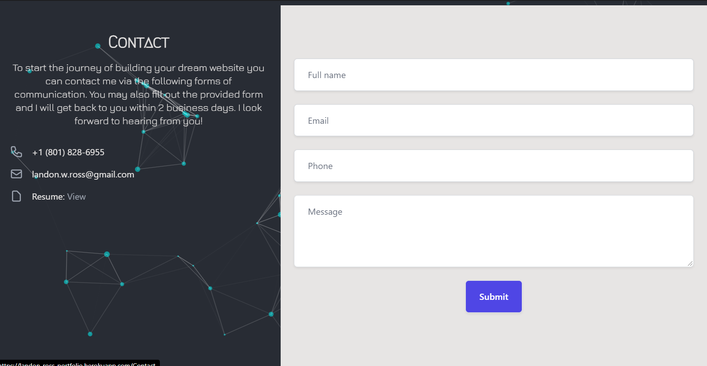

# Landons Portfolio

A page created to showcase recent projects I have worked on as well as a way for others to reach out and contact me for designing and building webpages.

* [Installation](#Installation)

* [Instructions](#Instructions)

* [License](#License)

* [Contributors](#Contributors)

* [Author](#Author)

* [Tests](#Tests)

## Installation
NA

## Instructions
Just follow the links to the page to view my work, or look through my code to learn about what I've created and how.

## License 
This project has the following license: MIT.

## Contributors
Landon Ross - Full Stack

## Tests
NA

## Questions
Please direct all questions to one of the following:

Email: landon.w.ross@gmail.com

GitHub: https://github.com/landonross
